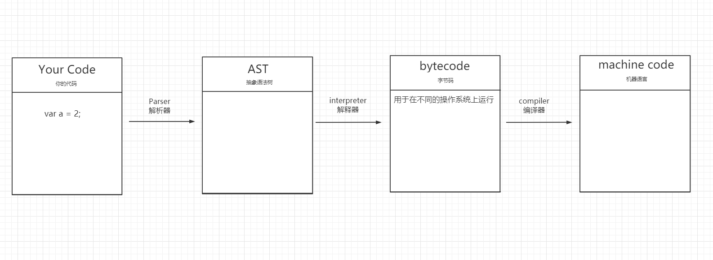
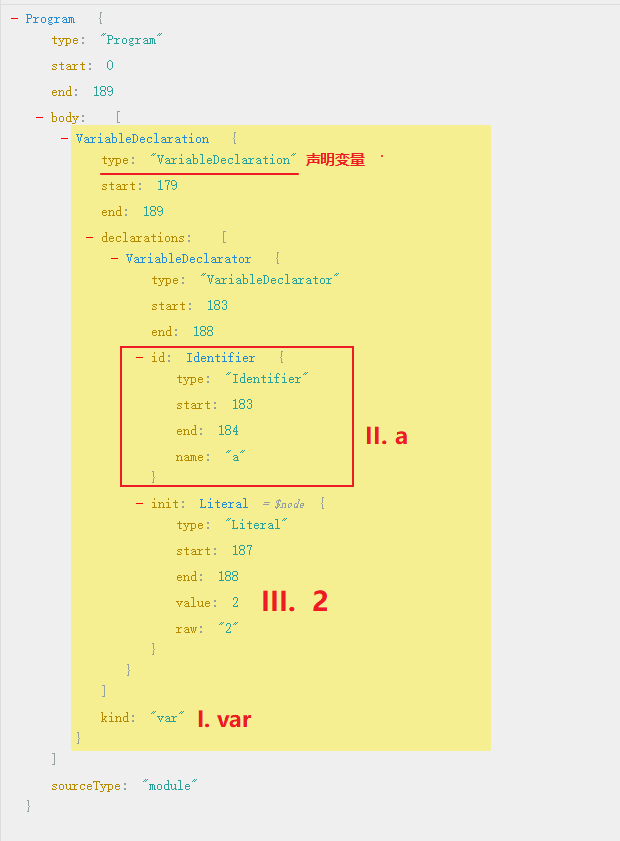
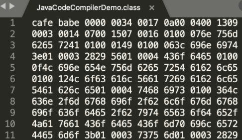
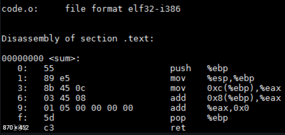

>    在写JavaScript代码时，它并没有很神奇的直接告诉电脑该干什么；它只是一门高级程序语言，所以需要先将你的代码转为电脑能看得懂的语言先（0和1）！
>
>   那为什么直接用最底层的语言编写代码呢？
>
> - 低级语言：
>   - 执行效率最快
>   - 难编写、难调试
>   - 不易于维护、不易于阅读
> - 高级语言：
>   - 语言越高级、执行效率越低（因为需要先编译）
>   - 简单易理解、易调试


## 编译原理

> 就是将你的代码转为电脑能看得懂的语言！

”编译器“ 三个步骤：

1. 词法分析（Lexing）: 

   ```markdown
   var a = 2;  转为 => var、 a、 =、 2、 ;
      ↑                ↑    ↑  ↑   ↑  ↑
     你的代码              这些叫做 词法单元
   Tip: 空格是否会被当做词法单元，取决于当前在这门语言的作用！
   ```

2. 语法解析（Parsing）:

   > 将词法单元流（数组） 转为  =>  AST 抽象语法树（程序语法结构的一种抽象表示）

3. 代码生成 ：

   > 将 AST  转为 =>  可执行代码

”解释器“ 四个步骤：

- 你的代码 => AST => byte code字节码 => machine code机器代码



1. 你的代码：

```
var a = 2;
```

2. AST抽象语法树：[抽象语法树生成](https://astexplorer.net/)



3. 字节码：

   > 一种中间码，是一个二进制文件。



4. 机器代码：

   > 机器指令码，最底层的程序语言。




## 引擎

> 从头到尾负责JS程序的编译和执行过程。
>
> 引擎分为两种：
>
> - JIT（Just In Time Compilation）: 运行时编译。  **JS使用这种**
> - AOT（Ahead of Time Compilation）: 运行前编译，提前生成机器代码。

JavaScript有许多执行引擎：google的V8引擎、webkit的JavaScript引擎......

