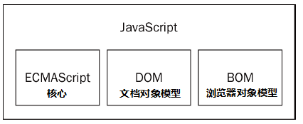

# JavaScript

> JavaScript 是一门弱类型语言，变量会隐性的转换。不需要提前声明变量的类型；可以随意更改变量的类型。

由三个部分组成：



- ECMAScript （ 就是ECMA-262定义的语言 ）。
  - 我们常说的 ES版本，就是 “ECMA-262的版本”。
  - 比如： 
    - ES5，2009年发布的  “第5个版本”
    - ES6，2015年发布的 “第6个版本”； 这个版本改动最大、富含了许多重要的新特性（类、模块、迭代器、生成器、箭头函数、promise、反射、代理 和 新的数据类型）

- DOM （ Document Object Model ），一个应用编程接口，用于操作HTML和XML文档的结构。
  - 比如：通过DOM树（用一个逻辑树来表示一个文档），我们可以使用DOM API 轻松实现增删查改。
- BOM （ Browser Object Model ），用于访问和操作浏览器窗口的API。
  - 比如： 网页前进后退、新建窗口、刷新页面等等...


其实仔细想想，为什么会出现DOM和BOM呢？ 主要原因就是我们需要对网页进行一些处理，而JS只是一个编程语言、它不可能平白无故就对其它不同种类的东西进行操作，必须借助某种中介的东西，来达到我们的目的。


## 基本语法

>任何语言的核心所描述的都是这门语言在最基本的工作原理。而描述的内容通常涉及语法、操作符、数据类型、内置功能等基本概念。

#### 1. 区分大小写

- 变量名 `test`  不等于 `Test`

- 函数名不能使用`typeof` ，因它是一个关键字（被js用了~）。

  - 关键字：用于控制语句的起始结束，或者执行特定操作等...

    保留字：保留给将来做关键字使用。

#### 2. 命名规则

- 首字符必须是 `字母` 、`下划线` 、`$` 开头。

- - `fistSecond`
  - `_leiku`
  - `$fontSize`

#### 3. 语句由分号结尾

- 不是必须的，但如果不加上、以后我们打包压缩代码时，可能会产生意想不到的错误。

#### 4. 严格模式

- 主要是对某些不确定的行为、或不安全的操作抛出错误。

```html
<script>
	"use strict"  // 在顶部添加这行代码就行了
	...
</script>

<script>
	function demo() {
		"use strict"// 也可以在函数顶部添加。
		...
	}
</script>
```

#### 5. 注释

- 单行注释： //
- 多行注释：/* */

#### 6. 变量

- ECMAScript的变量是**松散类型**的，简单说就是可以保存任何类型的数据。

```javascript
let a = "Json";
let b = function () {};
```


## 操作符

### 1. 赋值操作符

#### 简单赋值

用等于号（=）表示，将右手边的值赋值给左手边的变量。

```
let n = 999;

let a = 1, b = 4;     / 逗号用于在一条语句中多次操作。


let c = a + b;   // 5
let c = a - b;   // -3
let c = a * b;   // 4
let c = a / b;   // 0.25
let c = a % b;   // 1      取余
```

#### 复合赋值

- 加后赋值（+=）
- 减后赋值（-=）
- 乘后赋值（*=）
- 除后赋值（/=）
- 取模后赋值（%=）
- 左移后赋值（<<=）
- 右移后赋值（>>=）
- 无符号右移后赋值（>>>=）

```javascript
let a = 1;

a = a + 5;    // 6
简写形式：
a += 5;
```


###  2. 一元操作符

- n = n + 1;  简写:    `++n`
- n = n - 1;   简写：  `--n`

```javascript
let n = 1,
    f = 2;

let age = f + ++n;    / f + (n先自身+1) , 最后再赋值给a;
console.log(age);     // 4
console.log(n);       // 2  此时n已经被加一了
```

- `n++`  先算大表达式，最后再自身加一。

```javascript
let n = 1,
    f = 2;

let a = f + n++;   / 先执行 f + n 赋值给a, 最后n自身再+1;
console.log(a);    // 3
console.log(n);    // 2


let b = f + n--;   / 相同道理
console.log(b);    // 4
console.log(n);    // 1
```


### 3. 比较操作符

```javascript
let a = 1,
    b = "1",
    c = 20;

console.log(a == b);    / true   一般比较，会将转换类型，再比较

console.log(a === b);   / false  严格比较，不会转换类型

a > c;    // flase
a <= c;   // true
...
```


### 4. 条件操作符

#### 逻辑与 &&

使用 `&&` 符号表示逻辑与，指符号两端都为 true 时表达式结果为true。

```
let a = false,
    b = true;

//两个为真，表达式才成立.
if (a && b) {
    console.log('表达式成立');
} else {
    console.log('表达式不成立');
}
```

#### 逻辑或 ||

使用 `||` 符号表示逻辑或，指符号左右两端有一方为true，表达式即成立。

```javascript
let a = false,
    b = true;

//有一个为真，表达式都成立.
if (a || b) {
    console.log('表达式成立');
} else {
    console.log('表达式不成立');
}
```

#### 逻辑非  ！

使用 `!` 符号表示逻辑非，转换原来的布尔值。

```javascript
let a = false,
    b = true;

console.log(!a);    // true
console.log(!b);    // false
```

#### 优先级

优先级顺序： ！> && > ||

```javascript
console.log( true||false && false );   // true

/ 由于&&优先级高，所以先比较 false && false，返回false.
*/ 再比较 ture || false
```

但你可以使用括号()提高优先级.

```javascript
console.log( (true||false) && false );    // false

/ 由于括号内的优先级高，所以先比较 true || false，返回true.
*/ 再比较 true && false
```


## 流程控制语句

### if

> - 当条件成立的时候，执行表达式
> - 如果只有一条代码块，可以不用写 `{}`

### switch

> 可以将 `switch` 理解为 `if` 的另一种结构清晰的写法。
>
> 1. 如果表达式等于 `case` 中的值，将执行此 `case` 代码段，
> 2. `break` 关键字会终止 `switch` 的执行。
> 3. 最后没有任何 `case`匹配时将执行`default` 代码块。

```
switch (age) {
  case age < 6:
    console.log("小屁孩")
    break;
  case age < 18:
    console.log("小孩子")
    break;
  default:
    console.log("成年人")
}
```

**case 合用案例：**

- 如果`case`执行后缺少break则接着执行后面的语句。

```
switch (age) {
  case age < 6:      // 没有break;终止
  case age < 18:
    console.log("小孩子")
    break;
  default:
    console.log("成年人")
}
```

### 三元表达式

> `n ? a : b;`  当n为true时， 返回 a, 否则返回 b。（简单记：n返回真前假后）

### while

> 循环执行语句，需要设置跳出循环的条件否则会陷入死循环状态。

```
let row = 5;
document.write(`<table border="1" width="100">`);
while (row-- != 0) {
  document.write(`<tr><td>${row}</td></tr>`);
}
document.write(`</table>`);
```

### do/while

> 后条件判断语句，无论条件是否为真都会先进行循环体。


```
function a(row = 5) {
    let start = 0;
  do {
    let n = 1;
        do {
        document.write("*");
    } while(++n <= start);
    document.write("<br/>");
  } while(++start <= row);
}
```

### for

> 可以在循环前初始化初始计算变量。

for循环制作杨辉三角：


```javascript
for (let i =1; i<5; i++) {
        for (let n = 5-i; n > 0; n--) {
        document.write("'");
    };
        for (let m = i*2-1; m > 0; m--) {
        document.write("*");
    };
    document.write("<br/>");
}
```

### break/continue

> - break： 终止循环
> - continue： 跳过当前循环，进行下一次循环

获取所有偶数，所有奇数使用 `continue` 跳过：

```javascript
for(let i =1; i<10; i++) {
  if (i % 2) {
    continue;
  }
  console.log(i);
}
```

### label

> 标签(label) 为程序定义位置，可以使用`continue/break`跳到该位置。

```javascript
aaa: for(let i =1; i<10; i++) {
  bbb: for(let n =1; n<10; n++) {
    if (i%2 !=0) {
      console.log(i)
      continue aaa;
    }
  }
}
```