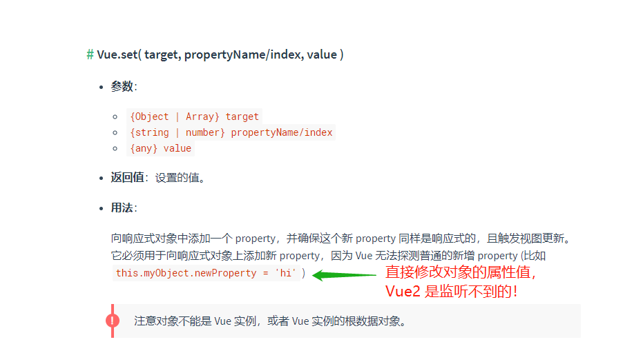
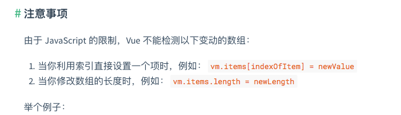

> 官方文档定义：**如果在实例创建之后添加新的属性到实例上，它不会触发视图更新**。这是因为vue2中使用 Object.defineProperty来进行数据监听！


## Q: vue2 监听不到直接更改对象的键值!!!

> **原因：** 当Vue初始化实例时，会使用 `Object.defineProperty` 对 `data` 选项上所有的属性进行 getter/setter转化，在 `getter` 中做数据依赖的处理，在 `setter` 中监听数据的变化、并通知所有使用此数据到的地方。[Vue2.6.11 部分源码](https://github.com/vuejs/vue/blob/dev/src/core/observer/index.js#L156-L193)
>
> **Tip:**    vue3使用ES6的Proxy，就无需再担心更改对象属性不会被监听到了。



### I. 使用 `$set` 来更新

> 我们可以使用官方提供的API进行响应式更新。

```
// 对象形式：(对象， 键， 值)
this.$set(this.obj, key, value);

// 数组形式：(数组， 下标， 值)
this.$set(this.list, index, value);
```

## II. 创建新的对象

```
// 对象形式: ({}, 原对象， 需要添加的键值对);
this.obj = Object.assign({}, this.obj, {key: value});

// 数组形式: ([], 原数组， 需要添加的键值对);
this.list = Object.assign([], this.list, {key: value});
```

### III. 更新Dom元素

> 因为当key改变时会引起新组件的创建和原有组件的删除，此时组件的生命周期钩子就会被触发。所以 `data` 更新了，自然就有新属性的 getter/setter

给父元素添加一个不重复的key值，当数据变更时就会更新父元素，从而重新创建子元素，视图也就相对应的变化了。

```Vue
<template>
	<ul :key="val"> // 添加变量，每当变化时、都会更新视图。
        <li>
    		{{user.name}} {{user.age}}
    	</li>
    </ul>
	<button @click="onClick">点击添加年龄</button>
</template>

<script>
export default {
    data() {
        return {
            user: { name: '李四'},
        	val: null,
	    }
    },
    methods: {
        onClick() {
            this.val = new Date()*1; // 每次点击都是添加不同的时间戳
            this.user['age'] = 12;
        }
    }
}
</script>
```


## Q：数组下标更新，视图没有更新

> [Vue为什么不能检测数组变动?](https://segmentfault.com/a/1190000015783546)

官方释义：[检测变化的注意事项](https://cn.vuejs.org/v2/guide/reactivity.html#%E6%A3%80%E6%B5%8B%E5%8F%98%E5%8C%96%E7%9A%84%E6%B3%A8%E6%84%8F%E4%BA%8B%E9%A1%B9)



还是用上面那三种方法解决！